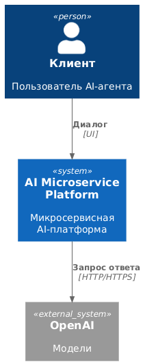
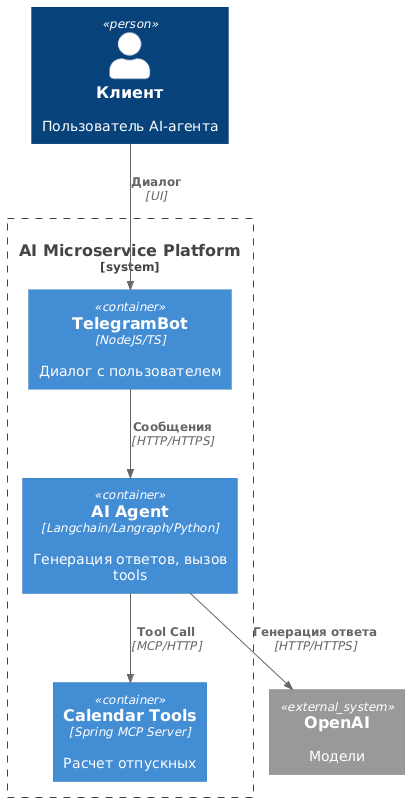
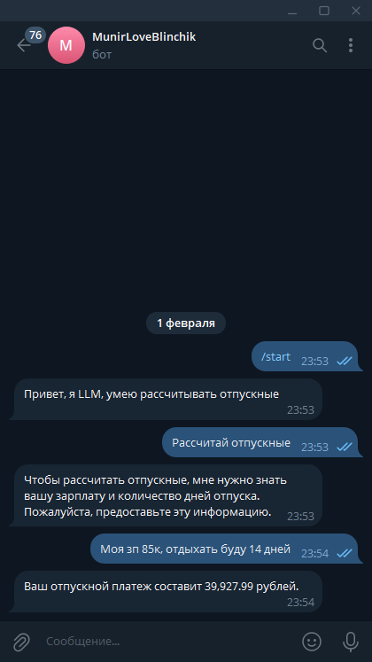
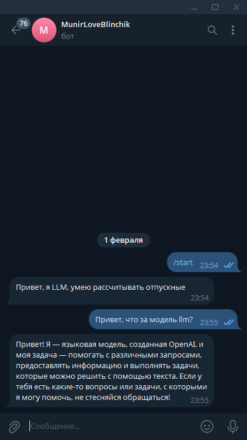

# AI агент

Агент доступен только через телеграмм бот [@blinchik_for_munir_bot](https://t.me/blinchik_for_munir_bot)

Данный проект является учебным и наглядно показывает реализацию ai-агента на архитектуре ReAct. Агент помимо основных функций
способен выполнять работу, определенную в инструменте, расположенном во внешнем контуре, с соединением по протоколу MCP. Проект установлен и функционирует на raspberry pi 5. 

## Архитектура проекта

Контекстная диаграмма:


	


Контейнерная диаграмма:



## Содержание

Проект состоит из:

app/ - сервисы

inf/ - инфраструктура

docs/ - документация по проекту

scripts/ - makefiles
	
## Требования перед запуском

0) Не менее 8 гб оперативной памяти;
1) Установленный Docker Desktop;
2) Подключение в ChatGPT(погуглить, есть прокси, которые делают это из РФ);
3) Api-key телеграмм бота(делать через @BotFather)
4) ! Заполненный ./inf/example.env !

## Запуск

Запустить команду из терминала/консоли:

```
git clone https://github.com/MunSunch/AI-Agent.git
cd AI-Agent
./scripts/run.sh
```

## Примеры запуска

Вставь скрины из телеграмм-бота:




